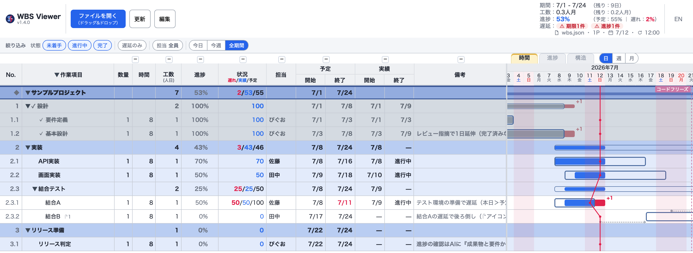
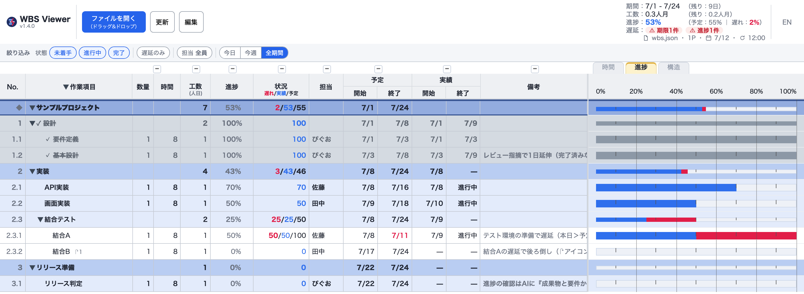
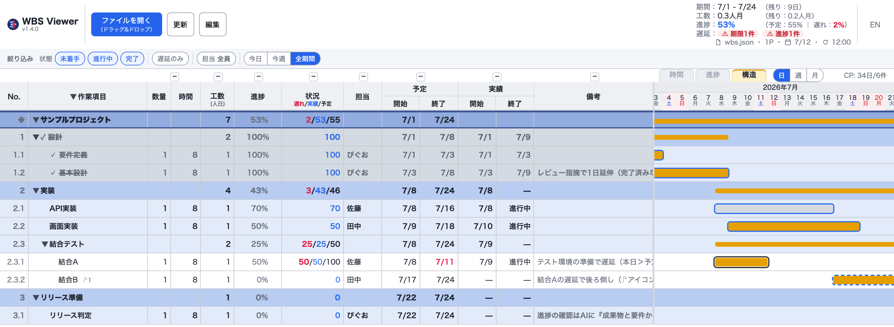
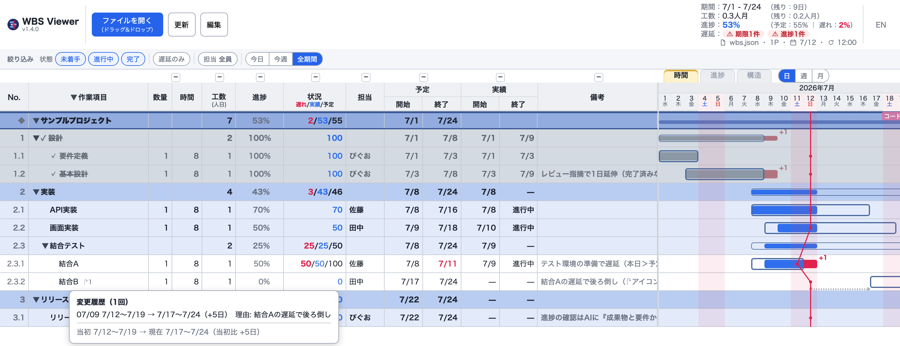
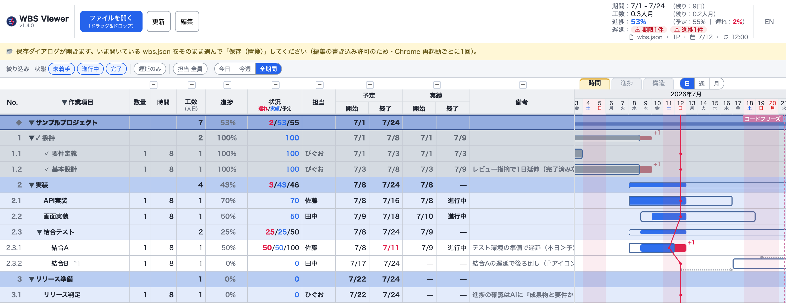
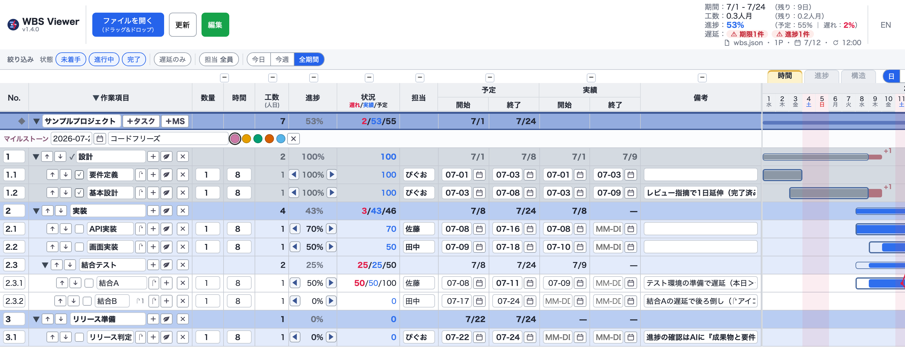

#  WBS Viewer

> 単一 HTML で動く、ガントチャート (時間軸)、EVM に倣った進捗軸ビュー、依存関係を可視化する構造ビュー、イナズマ線 (進捗線) を持つ WBS ビューア。サーバーも依存ライブラリもビルドも要らない。
> 画面上のアプリ名は **WBS Viewer** (`single-file-wbs` は配布名で、このリポジトリの名前)。

**[English README](README.en.md)**



右上の**「時間／進捗／構造」タブ**で切り替える。進捗ビュー (EVM に倣った完了率表示。実績、予定、遅れ):



## コンセプト

**AI 時代の管理者 (PL／テックリード) が、AI を含む少数精鋭チームを率いるためのローカル WBS。**
人間は GUI で、AI は素の JSON と [`CLAUDE.md`](CLAUDE.md) で、**同じ計画を編集する**。

- **対象**: 巨大プロジェクトのエンタープライズ PM ではなく、**AI を含む少数精鋭を率いる管理者** (作者自身がこのペルソナ。ドッグフーディングしている)
- **核の差別化 = 2 つの第一級インターフェース**: 大半の PM ツールは人間 (GUI) 前提。本ツールは **AI も第一級ユーザー** として、素の JSON と AI 可読な `CLAUDE.md` で計画を保守できる
- 設計の全体像と判断の経緯 → [`docs/`](docs/index.md) ([全体概要](docs/design/system-overview.md)、[ADR](docs/adr/))
- 背景の論考 → [WBS という至高ツールで、この AI 時代をサバイブする](https://zenn.dev/piguolabo/articles/99b5b30a028f80)

## 30 秒で始める

1. [Releases](https://github.com/piguo45/single-file-wbs/releases/latest) から `wbs_viewer.html` をダウンロード
2. Chrome で開く (`file://` のままでよい)
3. **「ファイルを開く」** (同じボタンへのドラッグ&ドロップでも可) で同梱データを読み込む
   - **`wbs_sample.json`** — 架空のサンプル。フォーマットのお手本
   - **`wbs_roadmap.json`** — 本ツール自身の開発計画 (実データ。Issue と連動し Claude Code が保守)

自分の WBS は `wbs_sample.json` を雛形にコピーして作る (ファイル名は自由)。編集して保存し、**「更新」** で反映する。
アップデートは新しい `wbs_viewer.html` を上書きするだけで、`wbs.json` のデータには触れない。

## できること

最新版の主な追加は **構造タブ** (依存関係とクリティカルパスの可視化) と **タスク詳細ダイアログ** (No. 列クリックで軽量編集)。更新履歴の全体は [Releases](https://github.com/piguo45/single-file-wbs/releases) を参照。

### 見る

- **イナズマ線 (進捗線)** — 本日線から **左へ突出すると遅延**。着手遅れや期限超過が折れ線で一目でわかる
- **予実オーバーレイのガント** — 予定 (枠) に実績 (塗りバー) を重ねる。**枠からのはみ出しは終了遅延 (赤 + N 日)、枠の左の空きは着手遅れ**。完了はグレー、親 (集約) は細いサマリーバーで状態が一目。配色は **色覚多様性 (CUD) に配慮**
- **進捗軸ビュー (EVM に倣う)** — 時間軸のガントに加え、**横軸を完了率 (0〜100%) にした進捗ビュー** をタブで切り替える。**実績 (EV)、予定 (PV)、遅れ** を横バーで示す (2 つの表示は混ぜない)
- **時間軸のスケール切替** — ガント (時間タブ・構造タブ) の横軸を **日／週／月** の 3 段階で圧縮表示できる。長い期間のプロジェクトを俯瞰しやすい
- **ヘッダの全体サマリ** — 期間、工数 (人月)、進捗 (EVM) を常時表示。前倒し分が相殺して全体が 0% でも、**遅れているタスクの件数をバッジ** で見落とさない (期限超過と進捗遅れを別々にカウントする)
- **祝日と土日が一目** — トップレベルの `holidays` で **祝日を日付ヘッダに赤字**、ガントの **土日と祝日の列を全高で薄ピンク** にする。残り営業日の計算も土日と祝日を除外する (同梱データに 2026年の日本の祝日入り)
- **簡素表示トグル** — ヘッダのタイトルをクリックすると、ロゴやバージョン表記を消して **「WBS」だけ** の見た目にできる (再クリックで戻る)。社内向けの自作ツールとして使いたい場面向け

### 構造を見る (依存関係とクリティカルパス)

- タスクに **`_deps`** (先行タスク id の配列) を書くと、**「構造」タブ** でどのタスクが遅れると全体が遅れるかが **クリティカルパス (オレンジ)** としてハイライトされる
- タスクのバーを **クリック** すると、その直接・間接の **先行タスクと後続タスク** だけをハイライトする (先行は実線、後続は破線の枠。矢印は引かず、軽量な可視化にとどめている)
- 存在しない id への参照や循環依存は **無視され、クラッシュしない** (壊れた入力への耐性は本ツール全体の方針)
- AI に「タスク X の依存関係を推定して」と頼むと、説明や成果物から先行タスクを推定し `_deps` に書いてもらえる



### 絞り込む

- **フィルタバー** — 左表の真上に **状態 (未着手／進行中／完了)、遅延のみ、担当 (複数選択)、期間 (今日／今週／全期間)** の 4 つの軸を並べる。軸の中は OR、軸をまたぐと AND で自由に重ねられる (例: 進行中かつ遅延かつ自分の担当)。**表示専用** で `wbs.json` も横軸 (時間範囲) も変えない。隠すのは目隠しであって削除ではない
- **列の折りたたみ** — 列ヘッダ上の **+/−** で列グループ (数量 + 時間、進捗、状況、担当、予定、実績、備考) を畳んだり広げたりできる。ガント領域を広く使える
- **列の幅調整** — 列境界をドラッグして「作業項目」「担当」「備考」列の幅を変えられる (ダブルクリックで既定幅に戻る)。長いタスク名・担当名・備考を扱うプロジェクトで見やすくなる

### 編集する

- **複数の編集経路** — ブラウザ内編集 (自動保存)、テキストエディタ、**AI チャット** (`CLAUDE.md` が同梱されており Claude Code はデータ形式を理解済み) に加え、**タスク詳細ダイアログ** (No. 列クリックで 1 行だけを軽量に編集) も使える
- **リスケ履歴** — 編集モードの **↷ ボタン** でリスケを確定すると、予定が自動更新されると同時に **理由つきで履歴に記録** される (`_planLog`)。ガントには直近の変更だけ **トレイル (点線)** で示され、タスク名の **↷ N** をクリックすると **全履歴と当初比** が吹き出しで見える。日付セルを直接編集する「訂正」とは区別され、訂正は履歴に残らない

### 土台

- **単一 HTML ファイル** — Chrome で開くだけ。サーバーも CDN もビルドも依存も要らない
- **データは事実だけの JSON 1 枚** — 持つのは予定と実績の日付だけ。工数 (数量 × 時間 ÷ 8、人日) や進捗、イナズマ線は **すべて自動計算** され、手でメンテする数字がない
- ほか: 複数プロジェクト、折りたたみ、マイルストーン線、完了タスクのグレー表示、備考 URL の自動リンク、日本語／英語 UI の切り替え

## 画面の操作

- **表示の切り替え**: 右上の **「時間／進捗／構造」タブ** で、ガント (時間軸)、進捗ビュー (完了率)、構造ビュー (依存関係) を切り替える
- **時間軸のスケール**: 時間タブと構造タブでは、タブの横に出る **「日／週／月」** ボタンで横軸の圧縮率を変えられる
- **絞り込み**: 左表の上の **フィルタバー** で状態、遅延、担当、期間を絞る。表示だけが変わり、データは動かない
- **行の折りたたみ**: プロジェクトや工程名、`▼/▶` をクリックする。**作業項目ヘッダの `▼/▶`** で全展開、全たたみ (誤操作は **Ctrl+Z** で直前の表示に戻せる)
- **列の折りたたみ**: 列ヘッダ上の **+/−** で列グループ (数量 + 時間、進捗、状況、担当、予定、実績、備考) を畳んだり広げたりする
- **列幅の調整**: 「作業項目」「担当」「備考」の各列ヘッダの右端をドラッグする (ダブルクリックで既定幅に戻る)
- **ガント**: マウスのある **日の列がハイライト** され日付ヘッダが強調される。**バーにカーソルを当てる** と予定と実績の正確な日付が出る
- **タスクの詳細**: **No. 列をクリック** すると中央にダイアログが開き、1 行だけを編集モードに入らずに確認・編集できる
- **依存関係のハイライト**: 構造タブでタスクのバーを **クリック** すると、先行・後続タスクだけが浮かび上がる (再クリックで解除)

## ブラウザ上で編集 (任意)

**「編集」ボタン** を ON にすると画面上から直接編集できる。変更は **約 0.4 秒後に `wbs.json` へ自動保存** される (保存状態は右上に常時表示)。

- できること: 各フィールドのその場編集 (No.、名前、数量、時間、担当、日付、備考。**工数は自動計算** なので編集対象外)。日付は `611` や `6/11` のような短縮入力、`YYYY-MM-DD`、📅 カレンダー (今年は `MM-DD` 表示) を受け付ける。行の追加 `＋`、削除 `✕` (確認あり)、上下移動 `⬆⬇`、**入れ子 (子タスク) の追加** (リーフを集計ノードに昇格して子をぶら下げる。工数は保存される)、**マイルストーン編集** (プロジェクト行の `＋MS`。日付、名前、5 色プリセット)、**リスケ** (↷ ボタン。新しい予定と理由を入力して確定すると、予定の更新と履歴記録が同時に行われる)
- できないこと (JSON 直編集か AI に依頼する): ドラッグ&ドロップでの並び替え、別の親への移動、No. の自動振り直し

### 予定変更の経緯を残す

「なぜ後ろ倒しになったのか」は、プロジェクトが長引くほど記憶から消える。**↷ ボタン** でリスケを確定すると、予定の更新と同時に **理由つきで履歴が残る**。ガントには直近の変更だけが控えめなトレイル (点線) で表示され、行やインクを増やさない。過去の全履歴は **↷ N をクリック** すればいつでも読み返せる。



<details>
<summary>⚠ 編集 ON には「ファイルの選び直し」が必要 (クリックで手順を表示)</summary>

「編集」ボタンを押すと、いきなり **ファイルの保存ダイアログが開く**。これは故障ではない。Chrome のセキュリティ上、**ブラウザがファイルに書き込む許可を得るには、保存ダイアログでユーザー自身がファイルを選ぶ必要がある** ためだ (`file://` で開くツールの宿命)。

1. **「編集」ボタン** を押す。保存ダイアログが開く
2. **いま開いている `wbs.json` と同じファイル** をそのまま選んで「保存」する
3. 「既存のファイルを置き換えますか？」には **はい**
4. 編集ボタンが **緑** になれば準備完了

「編集」を押した直後の画面 (黄色い案内バーが出る。この後ろに保存ダイアログが開いている):



この選び直しは **毎回ではなく、Chrome を起動してから最初の編集 ON の 1 回だけ** でよい (Chrome を再起動すると再び必要になる)。

</details>



## AI チャットで保守する

WBS が続かない最大の理由は **「更新の手間」** にある。このツールは表示ロジック (HTML) を固定しデータ (`wbs.json`) だけを編集する設計なので、**Claude Code 等の AI にチャットで更新を任せられる**。データが素の JSON 1 枚だからプラグインも連携設定も要らず、一括変更や負荷集計、ファイル横断の分析まで一言で頼める。

- 「設計レビューを今日完了にして」→ `actual.end` に本日が入る
- 「6月のタスクを全部 1 週間後ろ倒し」→ 一括変更
- 「タスク X の依存関係を推定して」→ 説明や成果物から先行タスクを推定し `_deps` に反映
- 「担当別の負荷を集計して」→ ビューアにない分析もその場で
- 「5月以前の完了をアーカイブして」→ バックアップ作成と整理

同梱の [`CLAUDE.md`](CLAUDE.md) で AI はデータ形式、編集ルール、運用方針を理解済みだ。

## データ形式 (wbs.json)

```json
{
  "holidays": [ "2026-07-20", { "date": "2026-08-11", "name": "山の日" } ],
  "projects": [
    {
      "name": "プロジェクト名",
      "milestones": [ { "date": "2026-09-30", "label": "リリース", "color": "#ef4444" } ],
      "tasks": [
        { "id": "1", "name": "フェーズ1", "children": [
          { "id": "1.1", "name": "作業", "qty": 1, "hours": 16, "assignee": "担当",
            "plan":   { "start": "2026-07-01", "end": "2026-07-05" },
            "actual": { "start": null, "end": null }, "note": "",
            "_deps":  ["0.9"],
            "_ai":    { "tokens": 70000, "minutes": 25, "model": "fable-5" },
            "_money": { "outsource": 50000, "currency": "JPY" },
            "_links": ["https://example.com/spec.md"] }
        ] }
      ]
    }
  ]
}
```

- タスクは最大 3 階層。`children` があれば集計ノード、なければリーフ (工数を持つ)
- `holidays` (任意、トップレベル) は全プロジェクト共通。文字列形は名称なし、`{ date, name }` 形は名称をツールチップ表示する。**祝日は日付ヘッダで赤字、土日とともに列を薄ピンクに** し、残り営業日の計算からも除外する
- **`_` 始まりのキーは自由に追加できるカスタムキー** だが、ビューアが読んで機能に使う例外が 3 つある: **`_deps`** (先行タスク id の配列。構造タブのクリティカルパス計算に使う)、**`_progress`** (0〜100 の進捗査定値)、**`_planLog`** (リスケ履歴)。それ以外の `_` キー (上例の `_ai` は AI 実績、`_money` は外注費、`_links` は参考リンク) は自由な構造で、ビューアは無視しつつブラウザ編集でも保持する。クリックして開きたい URL は `note` へ書く (自動リンク化される)
- 旧形式 `{ "project", "milestones", "tasks" }` (単一プロジェクト) も後方互換で読める
- 計算式や運用、異常系の扱いなど詳細仕様は [`CLAUDE.md`](CLAUDE.md) (仕様の単一ソース)

## 動作環境

**Google Chrome (最新版) 推奨**。File System Access API を使うため **Chromium 系ブラウザ専用** で、`file://` 直開きで動く。

- **Microsoft Edge** などの Chromium 系でも動く (エンジンが同じため。検証は Chrome で実施)
- 会社管理のブラウザでは、ポリシーで File System Access が無効だと **編集機能が使えない** ことがある (閲覧は可能。`edge://policy` で確認できる)
- Firefox／Safari は **非対応** (File System Access API 未対応)

## テストと既知の制限

`tests/` に正常系と異常系のサンプル JSON と e2e テストを同梱する (一覧は [`tests/INDEX.md`](tests/INDEX.md))。壊れた入力でもクラッシュしない方針 (graceful degradation)。

既知の制限: 大量行 (数千〜) で初期描画が重い (折りたたみで緩和できる)。同名プロジェクトは折りたたみ状態を共有する。キーボード操作とスクリーンリーダーには非対応 (マウス前提)。

## ライセンス

[MIT](LICENSE)
